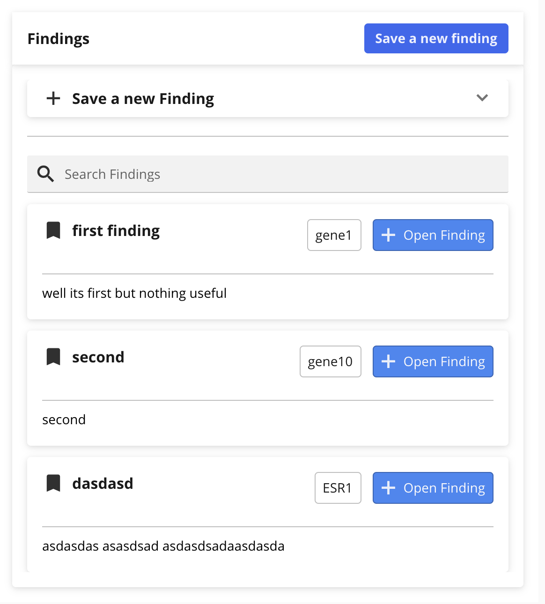

# \<epiviz-finding>

Web component to store insights when exploring genomic data.



TODO: 
- [ ] Update README
- [ ] Update Storybook
- [ ] Tests
- [ ] Documentation
- [ ] custom elements specification

This webcomponent follows the [open-wc](https://github.com/open-wc/open-wc) recommendation.

## Installation
```bash
npm i epiviz-finding
```

## Usage
```html
<script type="module">
  import 'epiviz-finding/epiviz-finding.js';
</script>

<epiviz-finding></epiviz-finding>
```

## Linting with ESLint, Prettier, and Types
To scan the project for linting errors, run
```bash
npm run lint
```

You can lint with ESLint and Prettier individually as well
```bash
npm run lint:eslint
```
```bash
npm run lint:prettier
```

To automatically fix many linting errors, run
```bash
npm run format
```

You can format using ESLint and Prettier individually as well
```bash
npm run format:eslint
```
```bash
npm run format:prettier
```

## Testing with Web Test Runner
To run the suite of Web Test Runner tests, run
```bash
npm run test
```

To run the tests in watch mode (for &lt;abbr title=&#34;test driven development&#34;&gt;TDD&lt;/abbr&gt;, for example), run

```bash
npm run test:watch
```

## Demoing with Storybook
To run a local instance of Storybook for your component, run
```bash
npm run storybook
```

To build a production version of Storybook, run
```bash
npm run storybook:build
```


## Tooling configs

For most of the tools, the configuration is in the `package.json` to reduce the amount of files in your project.

If you customize the configuration a lot, you can consider moving them to individual files.

## Local Demo with `web-dev-server`
```bash
npm start
```
To run a local development server that serves the basic demo located in `demo/index.html`
